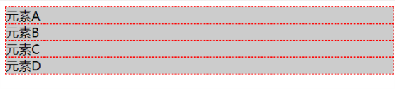
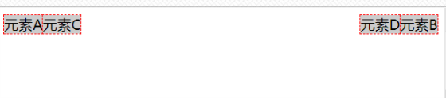
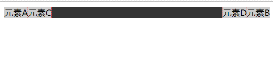
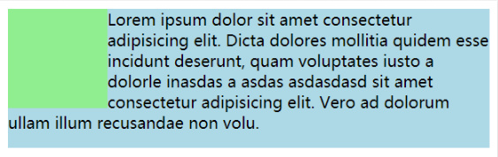
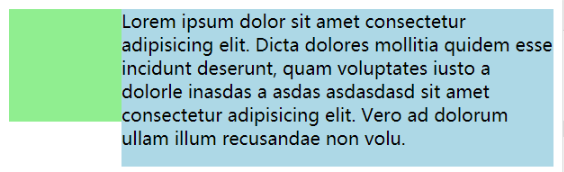
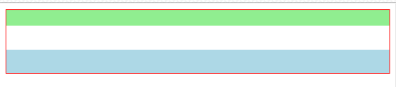
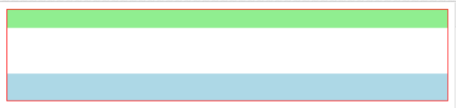

## BFC 是什么

 css 2.1 规范。BFC(Block formatting context)直译为"块级格式化上下文"。它是一个独立的渲染区域，只有Block-level box参与， 它规定了内部的Block-level Box如何布局，并且与这个区域外部毫不相干。 

目的是： 形成一个完全独立的空间，让空间中的子元素不会影响到外面的布局。

## 如何触发 BFC

为元素设置一些 CSS 属性，就能触发 BFC ，即生成一个完全独立的空间。、

最常用触发规则：

1.  `float`不为 `none`;
2.  `positiion` 不为 `static` 和 `relative`;
3.   `overflow` 为 `auto`, `scroll` 和 `hidden`;
4.  `display` 的值为 `table-cell` 或 `inline-block`.

## BFC 可以解决什么问题

### 1. 解决浮动元素令父元素高度坍塌的问题

正常情况：

```html
<div class="father">
    <div class="son left">元素A</div>
    <div class="son right">元素B</div>
    <div class="son left">元素C</div>
    <div class="son right">元素D</div>
</div>
```

```css
.father {
    background: #333;
}
.son {
    background: #ccc;
	outline: 1px dashed red;
}
```



为子元素添加浮动：

``` css
.left {
    float: left;
}
.right {
    float: right;
}
```



此时可以看到，`father` 元素已经不可见了(高度坍缩为 0 了)。

为 父元素 设置 BFC : 

```css
.father {
	background: #333;
    // 可根据具体情况设置适合的 css 属性来设置 BFC
    overflow: hidden;
}
```



可以看到，再设置了 BFC 后，`father` 元素再次可见，并且完全包裹住了内部浮动的子元素。

### 2. 解决两栏自适应布局问题(利用 float 实现时)

未设置 BFC 时： 

```html
<body>
    <div class="left"></div>
    <div class="main">...省略大量字符</div>
</body>
```

```css
.left {
	float: left;
	width: 100px;
	height: 100px;
	background: lightgreen;
}
.main {
	height: 140px;
	background: lightblue;
}
```



可以看到 `main` 元素的内容溢出到了左侧，要解决这个问题我们就可以为 `main` 元素设置 BFC

```css
.main {
	height: 140px;
	background: lightblue;
    // 可根据具体情况设置适合的 css 属性来设置 BFC
    overflow: hidden;
}
```



此时`main` 元素就是一个独立的空间，不会和浮动的 `left` 重合了。

### 3. 解决外边距垂直方向重合的问题

一般情况下，兄弟元素的外边距在垂直方向会**取两者的最大值而不是取和**。

``` html
<div class="father">
	<div class="son1"></div>
	<div class="son2"></div>
</div>
```

```css
.father {
	outline: 1px solid red;
}
.son1 {
	height: 20px;
	margin-bottom: 20px;
	background: lightgreen;
}
.son2 {
	height: 30px;
	margin-top: 30px;
	background: lightblue;
}
```



可以看到，虽然咱们分别给 `son1` 和 `son2` 都设置了 `margin` 但是，他们之间的 `margin` 却只有 `30px`，要解决这个问题就可以通过设置 BFC 来实现。

``` html
<div class="father">
	<div class="son1"></div>
	<div class="bfc">
		<div class="son2"></div>
	</div>
</div>
```

```css
.bfc {
    // 可根据具体情况设置适合的 css 属性来设置 BFC
    overflow: hidden;
}
```



可以看到，此时 `son1` 和 `son2` 元素的外边距都发挥了作用，不再重合在一起了。

##  注意

触发 BFC 的属性很多，但是选择要慎重，要考虑到实际的情况，避免影响到其他元素的布局，比如说，用 `float` 触发 BFC 的时候就要注意 `float` 可能对布局产生的影响所以一定要想清楚，用什么方式去处触发他。

## 这些问题的其他解决方案

要解决上述几个问题，其实不是只有设置 BFC 这一个解决方案。例如：

1. 解决浮动元素令父元素高度坍塌的问题

    - 让父元素也浮动起来，父元素和子元素一起脱离文档流。(代码量少，可能影响后面元素的排列)
	- 给父元素添加一个固定高度。(只适用于已知子元素高度的情况，不灵活，难以维护)
	- 在浮动的子元素后添加空元素，设置(clear: both)来清除浮动。(会增加无意义便签，不利于维护)
	- 为浮动的最后一个子元素设置伪元素(:after: {clear: both})。(同上)

2. 解决两栏自适应布局问题
    - 左边左浮动，右边设置左侧宽度的 `margin-left`
    - 左边绝对定位，右边设置左侧宽度的 `margin-left`
    - 左边绝对定位，右边同样绝对定位，`left`设为左侧宽度， `width` 设置 `100%`
    - 使用 `flex` 布局 等。

3. 解决外边距垂直方向重合的问题
    - 使用 `paddind` 代替 `margin` 。(之后需要设置 `padding` 的话改起来麻烦) 

---
[参考](<https://www.bilibili.com/video/av46317897?from=search&seid=11256248728986362428>)
